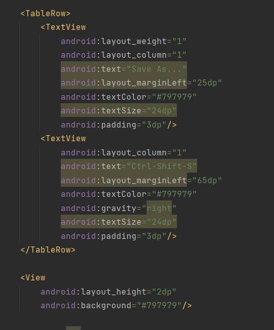

实验二

1)线性布局

实验结果：

代码部分：

1.水平线性布局嵌套垂直线性布局(结构如下)：

2.垂直线性布局嵌套TextView视图(结构如下):

2)表格布局

实验结果：

代码部分：

1.表格布局如下：

2.表格中一行根据布局结果有1~3个textview视图，如图所示，view视图为结果中的横线。

3)约束布局1

实验结果：

代码部分：

1.整体布局如下，由于xml文件本身为约束布局，故所有视图在整体下约束

2.首先的textview视图为计算机的标题、输入、显示

3.键盘部分，用水平线性布局嵌套垂直线性布局，在垂直线性布局中嵌套button来做按键

4)约束布局2

实验结果：

代码部分：

1.整体布局如约束布局1一样，所有视图在整体下约束

2.用垂直线性布局嵌套水平线性布局，在水平线性布局中嵌套一个iamgeview视图和textview视图布局头部

