#### 期中NotePad实验

一、SQLite数据库设计

<table>
    <tr>
        <th>列名</th>
    	<th>类型</th>
    	<th>描述</th>
    </tr>
	<tr>
		<td>id</td>
        <td>int primary key</td>
        <td>主键，标识文本</td>
	</tr>
	<tr>
		<td>note_title</td>
        <td>text</td>
        <td>标题</td>
	</tr>
	<tr>
		<td>note_text</td>
        <td>text</td>
        <td>内容</td>
	</tr>
	<tr>
		<td>note_tag</td>
        <td>text</td>
        <td>分类</td>
	</tr>
	<tr>
		<td>note_time</td>
        <td>datetime</td>
        <td>时间戳</td>
	</tr>
	<tr>
		<td>background_color</td>
        <td>int</td>
        <td>背景颜色</td>
	</tr>
</table>

数据库操作：

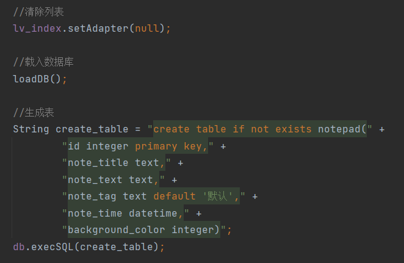

二、主界面

1）界面布局实现：

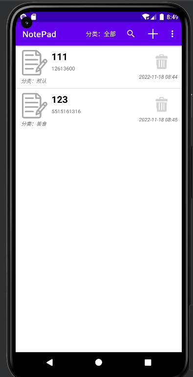

2）代码部分：

1.采用列表布局跟菜单实现整体布局

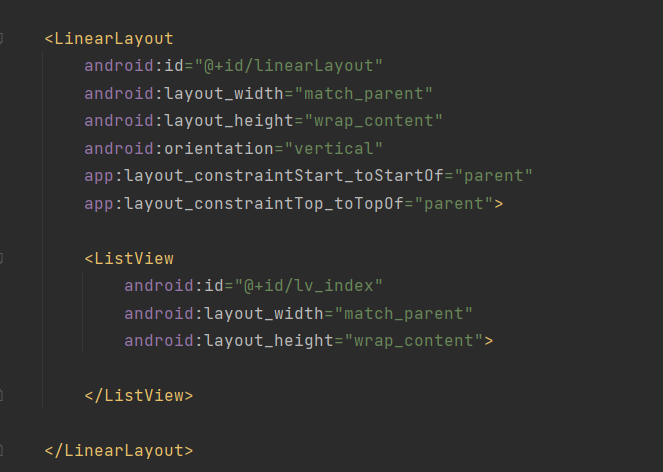

2.菜单项

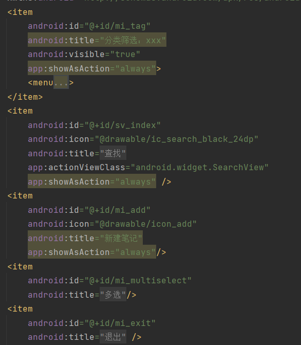

3.列表实现的单个笔记布局

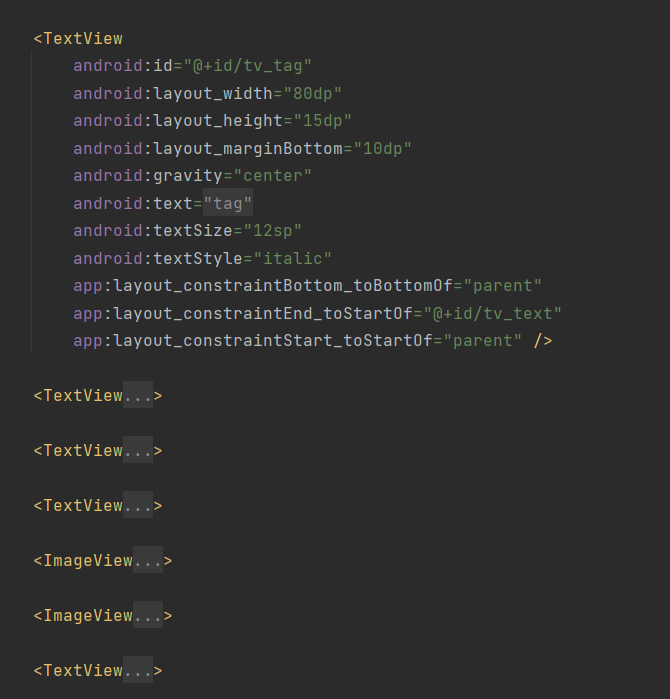

3）搜索功能

1.界面布局实现：

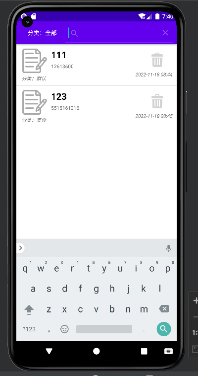

2.代码部分：

Ⅰ.搜索功能语句

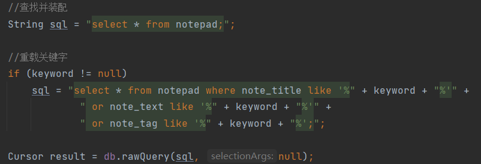

Ⅱ.分类搜索功能

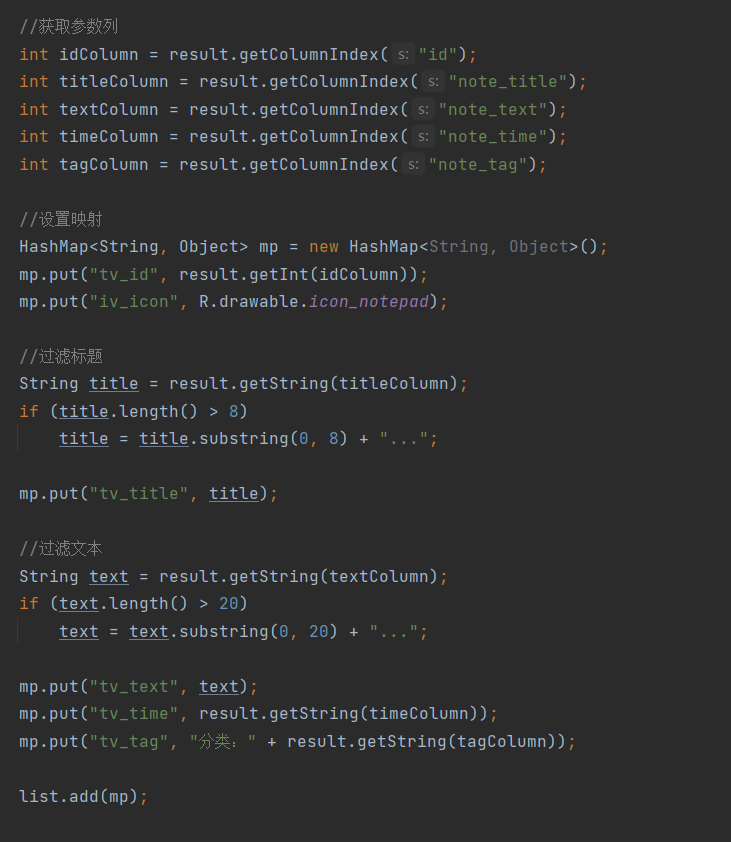

4）删除功能

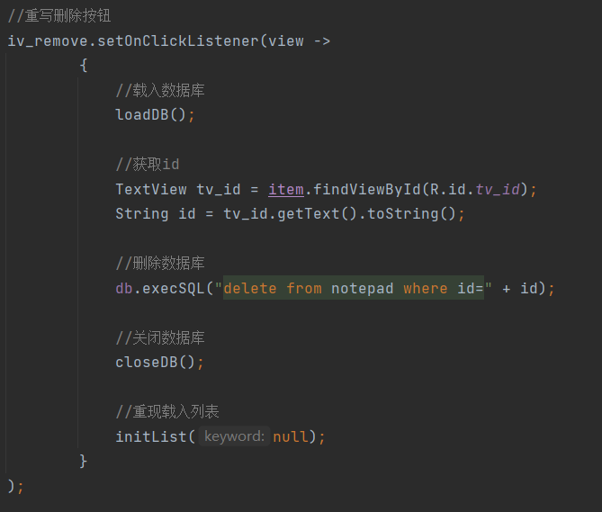

三、新建笔记

1）界面布局实现实现：

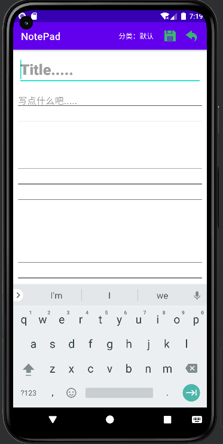

2）代码部分：

1.采用ScrollView嵌套TextView和编写的带有行数背景的text实现整体布局，在加上头部的菜单

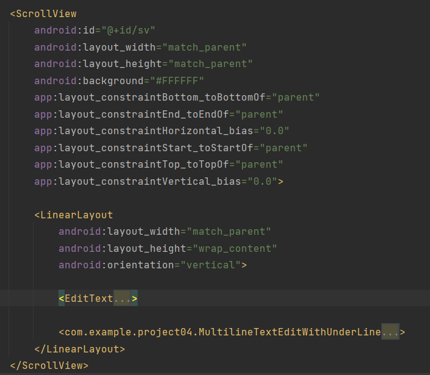

2.菜单实现

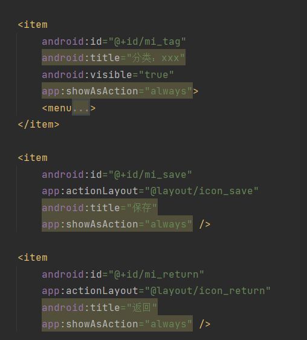

4.直接编辑已有的笔记功能实现

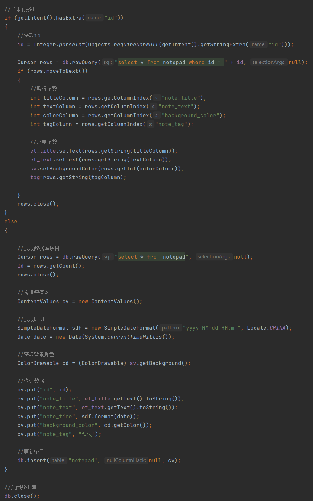

5.保存笔记功能实现

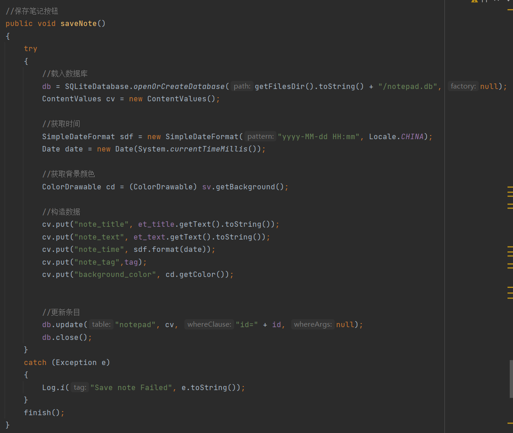

四、多选删除

1）界面布局实现：

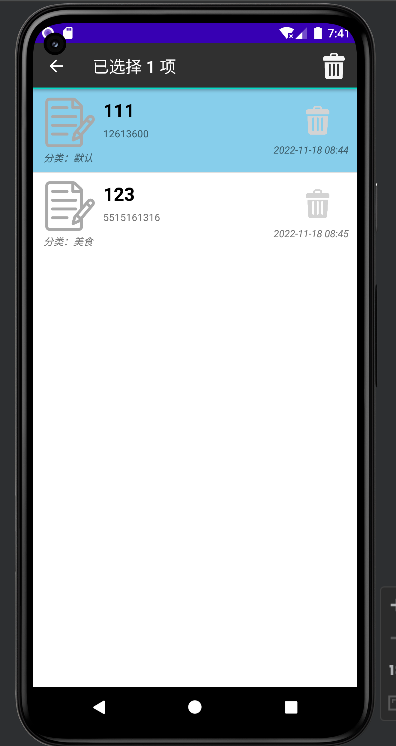

2）代码部分：

1.头部统计删除的菜单部分

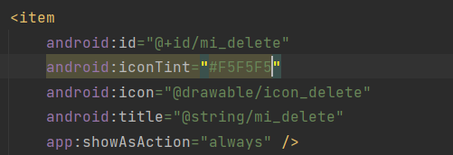

2.点击笔记功能实现

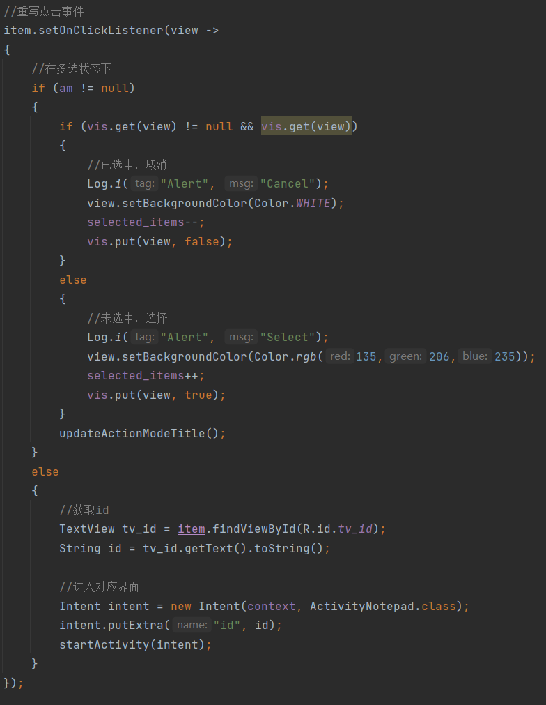

3.主界面长按笔记进入多选删除功能界面的实现

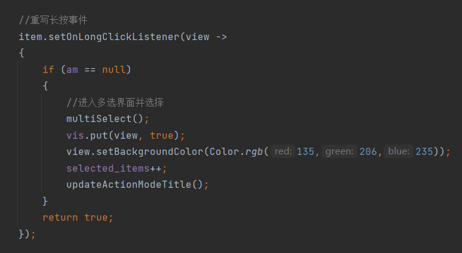